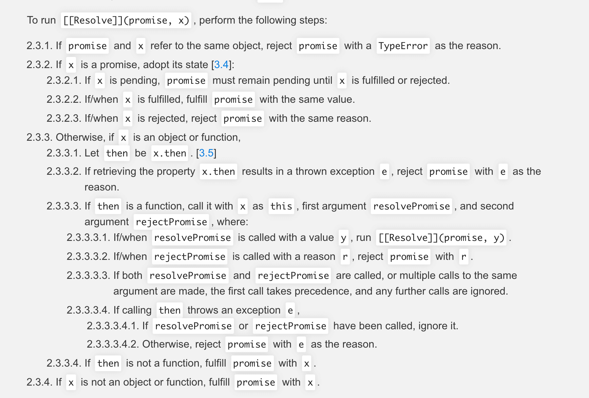
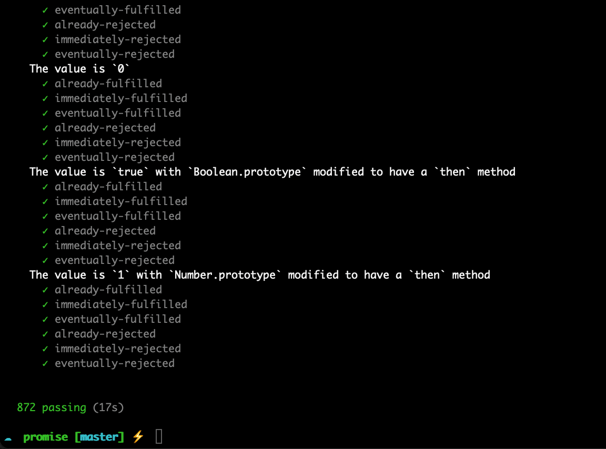

# 逐步实现一个符合 Promise A+ 规范的 promise

[Promise A+ 规范](https://promisesaplus.com/#point-57)

## 平时 promise 的基本用法

```javascript
new Promise((resolve, reject) => {
  console.log('这里立即执行')
  // resolve 与 reject 只能有一个
  resolve('成功了 ，这里会传递到 then 的成功回调 res 里')
  // reject('失败了 ，这里会传递到 then 的失败回调 err 里')
}).then(
  (res) => {
    console.log(res) // 打印上面 resolve 的值
  },
  (err) => {
    console.log(err) // reject时候 打印上面 reject 的值
  }
)
```

```javascript
const PENDING = 'PENDING'
const RESOLVED = 'RESOLVED'
const REJECTED = 'REJECTED'
//根据以上基本用法书写 首先 promise 接受一个 executor 执行器， executor 里有 resolve, reject 两个函数，其中 new promise 内部是立即执行的
class Promise {
  constructor(executor) {
    // 这里理解执行 对应上方 A 处
    this.state = PENDING // 初始状态为 pending
    this.reason = undefined // 失败回调时候的原因  即为reject()传递的值
    this.value = undefined // 成功回调的值  即为 resolve() 传递的值

    // executor中接受两个函数 resolve reject
    let resolve = (value) => {
      // 状态由 pending 变成成功 resolve
      if (this.state === PENDING) {
        this.state = RESOLVED
        this.value = value
      }
    }
    let reject = (reason) => {
      // 状态由 pending 变成成功 resolve
      if (this.state === PENDING) {
        this.state = REJECTED
        this.reason = reason
      }
    }
    // executor调用
    try {
      executor(resolve, reject)
    } catch (error) {
      // 报错直接抛出
      reject(error)
    }
  }
  // then 方法 then 中有两个值 成功的回调与失败的回调 这两值也阔以不穿  不传时候会向外传递
  then(onFulfilled, onRejected) {
    onFulfilled = typeof onFulfilled === 'function' ? onFulfilled : (val) => val
    onRejected =
      typeof onRejected === 'function'
        ? onRejected
        : (err) => {
            throw err
          }
    // 如果是成功就执行成功的回调用  失败就执行失败的回调
    if (this.state === REJECTED) {
      onFulfilled(this.value)
    }
    if (this.state === REJECTED) {
      onRejected(this.reason)
    }
  }
}
```

## 当 promise 的 then 中状态未发生变化时候

```javascript
new Promise((resolve, reject) => {
  setTimeout(() => {
    resolve(111111111)
  }, 0)
}).then(
  (res) => {
    console.log('res', res)
  },
  (err) => {
    console.log('err', err)
  }
)
```

- 有的时候 `then` 中不一定就是 成功 或者 失败 状态可能还是 pending ,
- 比如下方的代码使用上面的调用会得不到值 正常来说 `resolve(111111)` 会出现在 `console.log('res', res)`，
- 但是 因为 `setTimeout` 异步 宏任务会比微任务晚执行 导致 `state` 状态并未由 `pending` 变成 `resolve`, 同理 `reject` 时候亦如此
- 可以初始化两个 存储 `resolve()` `reject()` 的数组 用于该情况时候进行存储

```javascript
// 修改上方代码 初始化连个数组 添加到 constructor 中
this.onResolvedCbs = [] // the successful callbacks
this.onRejectedCbs = [] // the failed callbacks

// then 方法中添加是 pending 状态时候的逻辑
if (this.state === PENDING) {
  this.onResolvedCbs.push(() => {
    onFulfilled(this.value)
  })

  this.onRejectedCbs.push(() => {
    onRejected(this.reason)
  })
}

// resolve reject 中分别循环数组 onResolvedCbs onRejectedCbs 执行
this.onResolvedCbs.forEach((fn) => fn()) // resolve 中
this.onRejectedCbs.forEach((fn) => fn()) // reject 中
```

**<font color=pink size=10>到此一个基本 的 promise 完成</font>**

---

## 链式调用问题

```javascript
new Promise((resolve, reject) => {
  resolve(111111)
})
  .then(
    (res) => {
      console.log(res)
    },
    (err) => {}
  )
  .then(
    (res) => {
      console.log(res)
    },
    (err) => {}
  )
```

**我们在 `then` 中可以像如上代码那样进行链式调用，接下来进行实现。**

- 而 `then` 中的 **回调函数** 返回的 也可能是个 `promise` ，当是个 `promise` 时候会以该 `promise` 的状态向外传递
- 假设返回的是个 promise，记为 **promise2**，则需要先拿到当前的 `promise` ，对当前 `promise` 的 `resolve` `reject` 回调函数委托到外层 `promise2` 上进行处理，使用 `setTimeout` 拿到当前 `promise`,抽离出 `resolvePromise`函数，而该函数恰是链式调用的关键所在

```javascript
...
then(onFulfilled, onRejected){
  ...
  let promise2 = new Promise((resolve, reject) => {
    if (this.state === RESOLVED) {
      setTimeout(() => {
        //状态未变更时候可能抛出错误
        try {
          let x = onFulfilled(this.value) // 保存当前回调函数
          resolvePromise(promise2, x, resolve, reject)
        } catch (e) {
          reject(e)
        }
      }, 0)
    }
  }
  // 另外两种状态进行相同逻辑处理
  ...
  return promise2
}

```

`resolvePromise` 的实现遵循 Promise A+ 规范



翻译过啦就是

- 2.3.1. 如果 promise 和 x 指向同一个对象，promise 将拒绝执行且抛出一个 TypeError 作为拒因。
- 2.3.2. 如果 x 是一个 promise 对象。接收它的状态：
  - 2.3.2.1. 如果 x 处于 pending 状态，则必须保留其 pending 状态至 x 变为 fulfilled 或者 rejected。
  - 2.3.2.2. 如果 x 是 fulfilled 状态，则以 x 的值；来执行 promise。
  - 2.3.2.3. 如果 x 是 rejected 状态，则以 x 的拒因来拒绝执行 promise。
- 2.3.3. 否则，如果 x 是一个对象或者函数，
  - 2.3.3.1. 定义一个 then 变量将 x.then 赋值给变量 then。
  - 2.3.3.2. 如果 x.then 取值时抛出异常 e，则拒绝执行 promise 并以 e 作为拒因。
  - 2.3.3.3. 如果 then 是一个函数，用 x 代替 this 来调用它，resolvePromise 作为第一个参数， rejectPromise 作为第二个参数。
  - 2.3.3.3.1. 如果 resolvePromise 以值 y 为参数被调用，则运行 [[Resolve]](promise, y)。
  - 2.3.3.3.2.如果 rejectPromise 以拒因 r 为参数被调用，则以 r 为拒因拒绝执行 promise。
  - 2.3.3.3.3. 如果 resolvePromise 和 rejectPromise 都被调用，或者以相同的参数被调用多次，**则只执行第一次调用，其他调用被忽略。**
  - 2.3.3.3.4. 如果调动 then 方法抛出异常 e，
    - 2.3.3.3.4.1. 忽略 resolvePromise 或者 rejectPromise 的调用。
    - 2.3.3.3.4.2. 除此之外，拒绝执行 promise 并以 e 作为拒因
  - 2.3.3.4. 如果 then 不是一个函数，则以 x 为值执行 promise
- 2.3.4. 如果 x 不是一个对象或者函数，，则以 x 为值执行 promise

```javascript
const resolvePromise = (promise2, x, resolve, reject) => {
  // x 与 promise 是同一个对象时候 抛出错误
  if (x === promise2) {
    return reject(
      new TypeError('Chaining cycle detected for promise #<Promise>')
    )
  }
  // 当 x 是一个对象或者函数时候
  if ((typeof x === 'object' && x !== null) || typeof x === 'function') {
    let called
    try {
      let then = x.then
      if (typeof then === 'function') {
        then.call(
          x,
          (y) => {
            if (called) {
              return
            }
            called = true
            resolvePromise(promise2, y, resolve, reject)
          },
          (r) => {
            if (called) {
              return
            }
            called = true
            reject(r)
          }
        )
      } else {
        resolve(x)
      }
    } catch (error) {
      if (called) {
        return
      }
      called = true
      reject(error)
    }
  } else {
    resolve(x)
  }
}
```

## 嵌套问题优化

在 `promise` 使用中经常用于封装异步请求时候会有以下代码师范

```javascript
getData() {
  return new Promise((resolve,reject)=>{
    this.api.getList({data}).then(res=>{
      if(!成功) {
        reject(res)
      }
      resolve(res)
    })
  })
}
```

以上代码中`promise`形成嵌套，可将 `promise` `resolve reject` 进行中间缓存来解决嵌套 添加 `defer` 方法

```javascript
Promise.defer = Promise.deferred = function () {
  let dfd = {}
  dfd.promise = new Promise((resolve, reject) => {
    dfd.resolve = resolve
    dfd.reject = reject
  })
  return dfd
}
module.export = Promise
```

以上案例代码使用改版后的 promise 如下：

```javascript
getData() {
  let dfd = Promise.defer()
  this.api.getList(data).then(res=>{
    if(!成功) {
      dfd.reject(res)
    }
    dfd.resolve(res)
  })
  return dfd.promise;
}

```

至此 一个 符合 promise A+ 规范的 promise 基本完成

## 规范测试

- 全局安装 `promises-aplus-tests` 进行规范测试， `npm i promises-aplus-tests -g`
- 编写测试函数
- 终端运行`promises-aplus-tests promise.js`

## 通过


